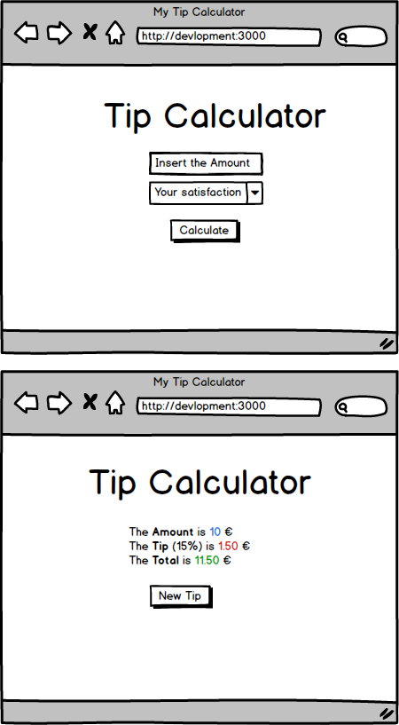

# Tip Calculator

Create a webapp to calculate the amount of a tip using HTML, CSS and Javascript 

## Mockup

- This is just a reference  
- Customize the layout

## Technical requirements

- Create a [single-page application (SPA)](https://en.wikipedia.org/wiki/Single-page_application)
- Validate the user input: check if the input is a number
- Use appropriate error handling

#### Form:
- Amount: the amount to pay
- Satisfaction: the satisfaction level, will be converted in tip percentage

#### Satisfaction levels:
- Excellent: tip 30%
- Very Good: tip 20%
- Good: tip 15%
- Ok: tip 10%
- Bad: tip 5%
- Very Bad: tip 0%

***For this assignment there will be a Deadline: 4:00 pm of Thursday 30th Jan.***  
You'll submit your code before 4pm, even if it's incomplete or broken.  
After the submission is closed you cannot push your code to Github Classroom anymore

***Bonus point if you user Git properly!***  
Commit & push your working code. Then create a new branch, implement a new feature and merge it when you finished. Use the commit message to document your work. Then start again with the next feature (if any).  
[Review the process here, if you need](https://git-scm.com/book/en/v2/Git-Branching-Basic-Branching-and-Merging)

## Documentation

All you need is [MDN](https://developer.mozilla.org/en-US/docs/Web/JavaScript/Reference) and [FbW12 Collection - Javascript](https://github.com/FBW-12/collection/tree/master/lessons#code-examples-and-recaps)
